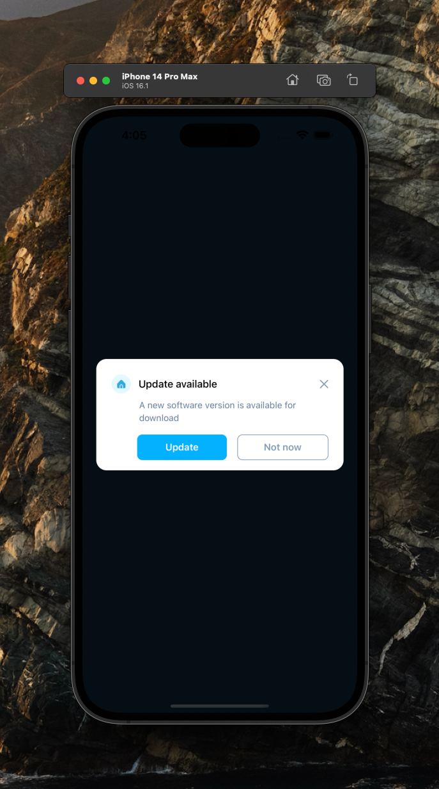

[](https://github.com/WrathChaos/react-native-global-modal-2)

[](https://www.npmjs.com/package/react-native-global-modal-2)
[](https://www.npmjs.com/package/react-native-global-modal-2)

[](https://opensource.org/licenses/MIT)
[](https://github.com/prettier/prettier)

<p align="center">
  
</p>

# Installation

Add the dependency:

```bash
npm i react-native-global-modal-2
```

## Peer dependencies

```json
"react-native-modal": "^13.0.1"
```

# Usage

## Import

```jsx
import GlobalModal, { ModalController } from "react-native-global-modal-2"
```

## Fundamental Usage

In `App.tsx` or wherever your root is, simply put the `GlobalModal` to root 
You can open it with custom `ModalData` with `ModalController` 

Note: This is just an example of the usage
```jsx
<NavigationContainer>
  <MainStack/>
  <GlobalModal/>
</NavigationContainer>
```

Call/control the animated modal with `ModalController`
**Custom layout option is WIP, coming soon!**
```js
import { ModalController } from "react-native-global-modal-2"

// Example of ModalData
// You can customize the modal as you want with this format
// Custom layout option is WIP, coming soon!
const data: ModalData = {
  title: 'Update available',
  description: 'A new software version is available for download',
  primaryButtonText: 'Update',
  outlineButtonText: 'Not now',
  titleProps: {
    imageSource: require('./assets/cross.png'),
  },
  onPrimaryButtonPress: () => {},
  onOutlineButtonPress: () => {},
};
// Show
ModalController.show(data);
// Hide
ModalController.hide()
```


### Customized Example

You can use any props from `react-native-modal` with prop drilling

```jsx 
<GlobalModal
    animationIn="fadeIn"
    animationOut="fadeOut"
    onBackdropPress={ModalController.hide}
/>
```

## Example Project 😍

You can check out the example project 🥰

Simply run

- `npm i`
- `react-native run-ios/android`

should work of the example project.

# Configuration - Props

## Fundamentals

| Property             |   Type   |  Default  | Description                                     |
|----------------------|:--------:| :-------: |-------------------------------------------------|
| title                |  string  | undefined | change the title                                |
| description          |  string  | undefined | change the descrition                           |
| primaryButtonText    |  string  | undefined | change the primary button's text                |
| onPrimaryButtonPress | function | undefined | set function when the primary button is pressed |
| onOutlineButtonPress | function | undefined | set function when the primary button is pressed |

## Customization (Optionals)

| Property       |    Type     |  Default  | Description                                                       |
| -------------- |:-----------:|:---------:|-------------------------------------------------------------------|
| style          |  ViewStyle  |  default  | set or override the style object for the main container           |
| buttonsContainerStyle    |  ViewStyle  |  default  | set or override the style object for the buttons' container style |
| TouchableComponent |  component  | Pressable | set your own component instead of default `Pressable` component   |
| buttonProps | ButtonProps |  default  | change button's props **(primary button)**                        |
| outlineButtonProps | OutlineButtonProps |  default  | change button's props **(outline button)**                        |


## Customization [Button] Component

| Property           |   Type    |  Default  | Description                                            |
|--------------------|:---------:|:---------:|--------------------------------------------------------|
| title              |  string   | undefined | change the title                                       |
| onPress | function  | undefined | set your function                                      |
| style              | ViewStyle |  default  | set or override the style object for the main container |
| textStyle          | TextStyle |  default  | set or override the style object for the text style    |


## Customization [OutlineButton] Component

| Property           |   Type    |  Default  | Description                                            |
|--------------------|:---------:|:---------:|--------------------------------------------------------|
| title              |  string   | undefined | change the title                                       |
| onPress | function  | undefined | set your function                                      |
| style              | ViewStyle |  default  | set or override the style object for the main container |
| textStyle          | TextStyle |  default  | set or override the style object for the text style    |

## Future Plans

- [x] ~~LICENSE~~
- [ ] More built-in modal types
  - [ ] Notification Type
  - [ ] One Button
  - [ ] One Outline Button
- [ ] **Custom Layout Feature**
- [ ] More and better screenshots
- [ ] Write an article about the lib on Medium

## Credits 

I inspired from [Roycechua's global modal example](https://github.com/roycechua/rn-global-modal-control-example)
Thank you so much [Roycechua](https://github.com/roycechua) 😍

I heavily inspired the design by [Patrick Marx](https://dribbble.com/shots/10762430/attachments/2430949?mode=media)
Thank you so much sir 🥳

## Author

FreakyCoder, kurayogun@gmail.com

## License

React Native Global Modal is available under the MIT license. See the LICENSE file for more info.
